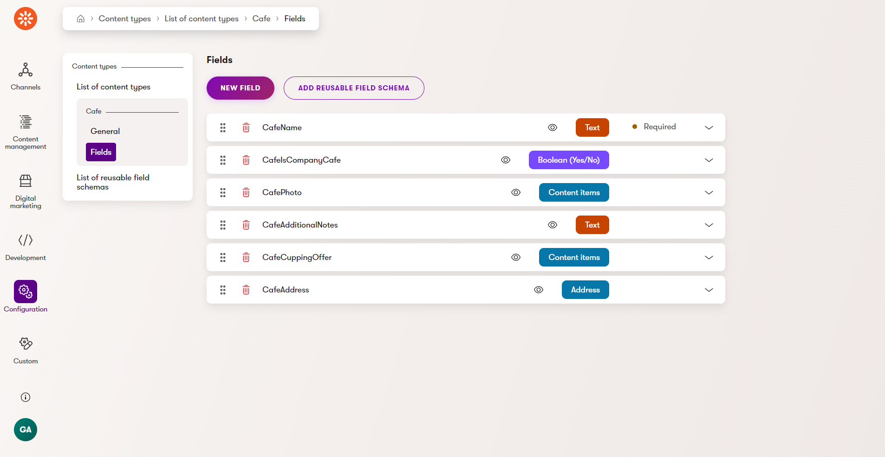
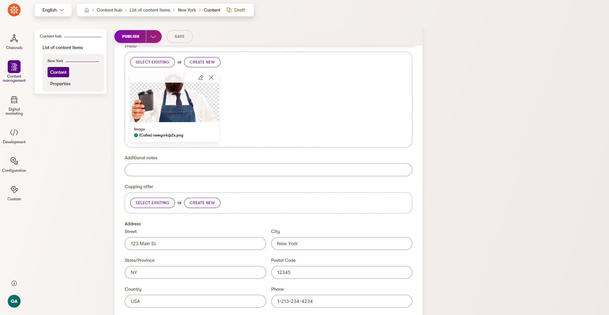
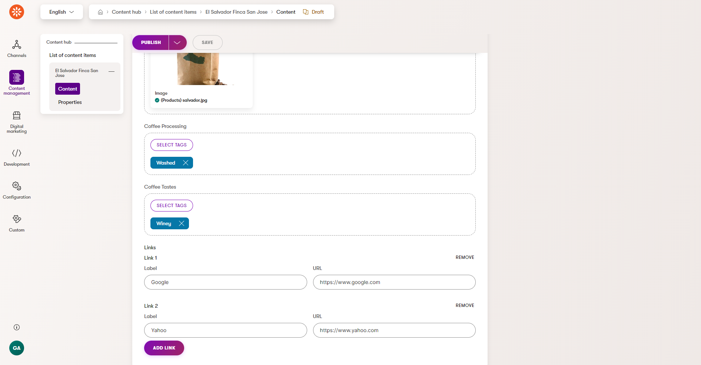

# Xperience by Kentico Labs: Custom Data Types

## Description

A Dancing Goat example of custom Address and Link data types which can be used to model owned/embedded content of a content item (web page, reusable, headless, email) as serialized JSON and strongly typed C# content type model classes.

## Screenshots

## Library Version Matrix

Xperience by Kentico 28.4.1

### Dependencies

---These are all the dependencies required to use (not build) the library---

- [ASP.NET Core 8.0](https://dotnet.microsoft.com/en-us/download)
- [Node.js LTS](https://nodejs.org/en/download)
- [Xperience by Kentico](https://docs.kentico.com/changelog)

## Quick Start

1. Install all dependencies (above 👆)
1. Clone the repository
1. Run the .NET project using the .NET CLI or included [VS Code task](https://code.visualstudio.com/docs/editor/tasks) (`dotnet: watch DancingGoat`)
1. Run the Webpack dev server using `npm start` in the `~/DancingGoat.Admin/Client` folder or included VS Code task (`npm: start - src/DancingGoat.Admin/Client`)
1. Open Xperience admin <http://localhost:28016/admin> and try modeling with the custom data types (username: administrator, password: Pass@12345)

## Usage Guide

Additional project details can be found in the [Usage Guide](./docs/Usage-Guide.md).

## Contributing

To see the guidelines for Contributing to Kentico open source software, please see [Kentico's `CONTRIBUTING.md`](https://github.com/Kentico/.github/blob/main/CONTRIBUTING.md) for more information and follow the [Kentico's `CODE_OF_CONDUCT`](https://github.com/Kentico/.github/blob/main/CODE_OF_CONDUCT.md).

Instructions and technical details for contributing to **this** project can be found in [Contributing Setup](./docs/Contributing-Setup.md).

## License

Distributed under the MIT License. See [`LICENSE.md`](./LICENSE.md) for more information.

## Support

---Select the correct name for the support policy---

This project has **Kentico Labs limited support**.

See [`SUPPORT.md`](https://github.com/Kentico/.github/blob/main/SUPPORT.md#full-support) for more information.

For any security issues see [`SECURITY.md`](https://github.com/Kentico/.github/blob/main/SECURITY.md).
